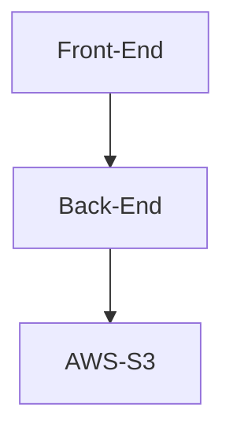

## 構成

フロントエンドでユーザーから画像ファイルの入力を受け取り、バックエンドサーバーに渡して、そこから S3 にアップロードします。



## フロントエンド

React を使って画像の入力を受付け、 バックエンドへと投げるフロントエンドアプリケーションを作成します。

### 開発環境

- node: v18.14.0

``` json
"react": "^18.2.0",
"vite": "^4.4.5",
"typescript": "^5.0.2"
```

ファイルを選択ボタンのクリックにより画像ファイルを受けて、プレビュー表示した後に、アップロードボタンをクリックすることで画像をアップロードすることとします。

### 画像の入力コンポーネント

画像の入力フォームを作成します。
DOM API によりファイル選択イベントの発火を input タグでなく button タグに持たせたいので、以下の記事を参考に input タグを装飾しました。

https://zenn.dev/catnose99/scraps/94930adea0c875

``` App.tsx
function App() {
  const inputFileRef = useRef<HTMLInputElement>(null);

  return (
    <>
      <h2>画像をアップロード</h2>
      <div>
        
        <input
          type="file"
          ref={inputFileRef}
          accept="image/*"
          style={{ display: "none" }}
        />
        <button onClick={() => inputFileRef.current?.click()}>
          ファイルを選択
        </button>
      </div>
    </>
  );
}
```

### 画像のプレビュー表示
上で作成したコンポーネントに画像のプレビュー機能を実装していきます。

``` App.tsx
function App() {
  const [previewImage, setPreviewImage] = useState("");
  const inputFileRef = useRef<HTMLInputElement>(null);

  const handleChangePreview = (ev: React.ChangeEvent<HTMLInputElement>) => {
    if (!ev.target.files) {
      return;
    }
    const file = ev.target.files[0];

    setPreviewImage(URL.createObjectURL(file));
  };

  return (
    <>
      <h2>画像をアップロード</h2>
      <div>
        
        <input
          type="file"
           onChange={handleChangePreview}
          ref={inputFileRef}
          accept="image/*"
          style={{ display: "none" }}
        />
        <button onClick={() => inputFileRef.current?.click()}>
          ファイルを選択
        </button>
      </div>
    </>
  );
}
```

ファイルを選択すると以下のように画像を選択してブラウザ上に表示します。


### フロントエンドからのHTTPリクエスト

バックエンドへ画像データを投げる関数を作成します。
追加した画像を FromData としてサーバーに送信します。

https://javascript.keicode.com/newjs/how-to-use-formdata.php

```ts
import axios from "axios";

export async function createUploadImage(file: File) {
  const formData = new FormData();

  Object.entries({ file }).forEach(([key]) => {
    formData.append(key, file);
  });

  const res = await axios.post(url, formData, {
    headers: {
      "Content-Type": "multipart/form-data",
    },
  });

  return res.data
}
```

また、アップロードボタンクリック時に `inputFileRef` から画像ファイルを取得します。

```tsx
<button onClick={() => {
  const fileList = inputFileRef.current?.files;
  console.log(fileList);
}}>アップロードする</button>
```

これらの関数をコンポーネントに加えます。

``` App.tsx
function App() {

  const inputFileRef = useRef<HTMLInputElement>(null);

+  const handleClickUpload = async () => {
+    const fileList = inputFileRef.current?.files;
+      if (!fileList) {
+        return;
+      }
+    const file = fileList[0];
+    const res = await createUploadImage(file);
+    console.log(res);
+  };

  return (
    <>
      <h2>画像をアップロード</h2>
      <div>
        
        <input
          type="file"
          onChange={handleChangePreview}
          ref={inputFileRef}
          accept="image/*"
          style={{ display: "none" }}
        />
      </div>
      <button onClick={() => inputFileRef.current?.click()}>
        ファイルを選択
      </button>
+       <button onClick={handleClickUpload}>アップロードする</button>
    </>
  );
}
```

バックエンドがないので動作を見ることはまだできませんが、ひとまずフロントはこれで OK です。

## バックエンド

NestJS を使ってバックエンドを作ります。

### 開発環境

- node: v18.14.0

``` json
"@nestjs/common": "^8.0.0",
"@nestjs/core": "^8.0.0",
"rxjs": "^7.2.0",
"typescript": "^4.3.5"
```

HTTP POST リクエストによるファイルのアップロードにおいて、`multipart/form-data` 形式で投稿されたデータを処理するために、以下の型定義ファイルをインストールします。

`yarn add -D @types/multer`

### Controller
HTTP リクエストの処理を行う Controller を作成します。

作成した NestJS プロジェクトに `src/images/images.controller.ts` と `src/images/images.module.ts` を作成します。


``` images.controller.ts
import {
  Controller,
  Post,
  UploadedFile,
  UseInterceptors,
} from "@nestjs/common";
import { FileInterceptor } from "@nestjs/platform-express";
import type { Express } from "express";

Controller("images")
export class ImagesController {
  @UseInterceptors(FileInterceptor("file"))
  @Post("upload")
  uploadFile(@UploadedFile() file: Express.Multer.File) {

    return { filename: file.originalname };
  }
}
```

``` images.module.ts
import { Module } from "@nestjs/common";
import { ImagesController } from "./images.controller";

@Module({
  controllers: [ImagesController],
})
export class ImagesModule {}
```


`app.module.ts` につなぎこみます。
``` app.module.ts

@Module({
-   imports: [],
+   imports: [ImagesModule],
  controllers: [AppController],
  providers: [AppService],
})
export class AppModule {}
```

cors の設定をし、フロントエンドから API を叩けるようにします。
``` main.ts
async function bootstrap() {
  const app = await NestFactory.create(AppModule);
  // すべてのオリジンからのアクセスを許容する設定
+  app.enableCors();
  await app.listen(3000);
}
bootstrap();
```

開発サーバーをそれぞれ立て、フロントエンドからバックエンドへデータの受け渡しができているか確認してみます。

フロントエンドから選択した画像をバックエンドに送信します。


成功してブラウザの開発者コンソールにレスポンス(ファイル名)が表示されます。

https://docs.nestjs.com/techniques/file-upload

## ストレージ

続いて、バックエンドからストレージへの画像アップロード処理を作っていきます。ストレージサービスには AWS S3 を使います。

https://docs.aws.amazon.com/ja_jp/AmazonS3/latest/userguide/Welcome.html

### AWSへの接続

App.module.ts から ConfigModule を使って、 AWS への接続に使う環境変数を NestJS アプリで読み込みます。

`yarn add -D @nestjs/config`

``` App.module..ts
import { Module } from "@nestjs/common";
import { ConfigModule } from "@nestjs/config";
import { AppController } from "./app.controller";
import { AppService } from "./app.service";
import { ImagesModule } from "./images/images.module";

@Module({
  imports: [
    ConfigModule.forRoot({
      load: [
        () => ({
          aws: {
            region: process.env.AWS_REGION,
            accessKey: process.env.AWS_ACCESS_KEY_ID,
            secretKey: process.env.AWS_SECRET_ACCESS_KEY,
            s3BucketName: process.env.AWS_BUCKET_NAME,
          },
        }),
      ],
      isGlobal: true,
    }),
    ImagesModule,
  ],
  controllers: [AppController],
  providers: [AppService],
})
export class AppModule {}
```

次に main.ts で AWS の設定をします。

`yarn add -D aws-sdk`

``` main.ts
+ import { ConfigService } from "@nestjs/config";
+ import { config } from "aws-sdk";

async function bootstrap() {
  const app = await NestFactory.create(AppModule);
  app.enableCors();

+  const configService = app.get(ConfigService);
+  config.update({
+    accessKeyId: configService.get("aws.accessKey"),
+    secretAccessKey: configService.get("aws.secretKey"),
+    region: configService.get("aws.region"),
+  });

  await app.listen(3000);
}
bootstrap();
```

images.module.ts で ConfigModule を使う設定をします。
``` images.module.ts
+ import { ConfigModule } from "@nestjs/config";

@Module({
+  imports: [ConfigModule],
  controllers: [ImagesController],
  providers: [ImagesService],
})
export class ImagesModule {}
```

### サービスクラスを作成する
AWS S3 へファイルアップロードを実際に行う `images.service.ts` を作成します。

``` images.service.ts
import { Injectable } from "@nestjs/common";
import { ConfigService } from "@nestjs/config";
import { S3 } from "aws-sdk";
import { v4 as uuid } from "uuid";

@Injectable()
export class ImagesService {
  constructor(private readonly configService: ConfigService) {}

  async upload(file: Express.Multer.File) {
    const s3 = new S3();

    const uploadParams = {
      Bucket: this.configService.get("aws.s3BucketName"),
      Body: file,
      Key: uuid(),
    };

    await s3.upload(uploadParams).promise()
  }
}
```

`ImageService` に `upload` 関数を作成し、 `ImagesController` から受け取った画像ファイルを S3 にアップロードします。

最後に `ImageModule` と `ImageController` から `ImageService` を使えるように設定します。

```ts
// images.controller.ts
+ import { ImagesService } from "./images.service";

@Controller("images")
export class ImagesController {
+  constructor(private readonly imagesService: ImagesService) {}

  @UseInterceptors(FileInterceptor("file"))
  @Post("upload")
  async uploadFile(@UploadedFile() file: Express.Multer.File) {

-    return { filename: file.originalname };
+    await this.imagesService.upload(file);
  }
}

// images.module.ts
+ import { ImagesService } from "./images.service";

@Module({
  imports: [ConfigModule],
  controllers: [ImagesController],
+  providers: [ImagesService],
})
export class ImagesModule {}
```

## おまけ

フロントエンドでの単体テストを行います。  
ここでの単体テストは、ユーザーがファイルを選択することで `アップロードする` ボタンが表示されることをテストしていきます。

``` App.spec.tsx
test("画像が選択されると`アップロードする`ボタンを表示する");
```

### 環境
``` json
"@testing-library/jest-dom": "^6.1.3",
"@testing-library/react": "^14.0.0",
"@testing-library/user-event": "^14.4.3",
"jsdom": "^22.1.0",
"vitest": "^0.34.3"
```

### テストコード

まず最初に `Arrange, Act, Assert` の `Assert` の部分から書いていきます。

https://tech.pepabo.com/2021/08/23/writing-unit-test-with-aaa/

最終的に `アップロードする` ボタンを表示することが確認できればいいので、以下のようにします。

``` App.spec.tsx
test("画像が選択されると`アップロードする`ボタンを表示する", () => {

  expect(screen.getByRole("button", { name: "アップロードする" })).toBeInTheDocument();
});
```

次に `Act` を書いていきます。

``` App.spec.tsx
test("画像が選択されると`アップロードする`ボタンを表示する",　async () => {

  const user = userEvent.setup();

  // user-event を使って擬似的にDOMを操作する
  // https://testing-library.com/docs/user-event/utility/#upload
  await user.upload(input, file);

  expect(screen.getByRole("button", { name: "アップロードする" })).toBeInTheDocument();
});
```

`imageInput` と `file` の変数定義がされていませんが一旦おいておきます。

最後に `Arrange` 部分を書いていきます。


``` App.spec.tsx
test("画像が選択されると`アップロードする`ボタンを表示する",　async () => {
  const user = userEvent.setup();

  render(<App />);

  const input = screen.getByLabelText("file");

  const file = new File(["hello"], "hello.png", { type: "image/png" });

  await user.upload(input, file);

  expect(screen.getByRole("button", { name: "アップロードする" })).toBeInTheDocument();
});
```

ここで、テストコードの `screen.getByRavelText("file")` に合わせてプロダクトコードの `input` タグに `aria-label` を設定します。

``` App.tsx
function App() {
  // 省略
  return (
   // 省略
    <input
      type="file"
      onChange={handleChangePreview}
      ref={inputFileRef}
      accept="image/*"
      style={{ display: "none" }}
+      aria-label="file"
    />
  // 省略
  );
}
```

ここまでで `aria-label` が `file` となっている要素を取得し、user-event を使ってファイルの選択を擬似的に行う流れになっています。

この状態でテストを実行すると以下のようなエラーが吐かれます。
```
TypeError: The "obj" argument must be an instance of Blob. Received an instance of File
 ❯ new NodeError node:internal/errors:399:5
 ❯ Function.createObjectURL node:internal/url:1027:13
 ❯ handleChangePreview src/App.tsx:15:25
     13|     const file = ev.target.files[0];
     14| 
     15|     setPreviewImage(URL.createObjectURL(file));
       |                         ^
     16|   };
     17| 
```

`App.tsx` の `handleChangePreview` 関数で `URL.createObjectURL()` 関数を実行していますが、 `js-dom` では `URL.createObjectURL` を実装していないのでモックする必要があります。

https://github.com/jsdom/jsdom/issues/1721

``` App.spec.tsx
import { expect, test, vi } from "vitest";

beforeEach(() => {
  // URL.createObjectURL が "hello.png" を返すように設定する
  URL.createObjectURL = vi.fn(() => "hello.png");
});

test("画像が選択されると`アップロードする`ボタンを表示する",　async () => {
  const user = userEvent.setup();

  render(<App />);

  const input = screen.getByLabelText("file");

  const file = new File(["hello"], "hello.png", { type: "image/png" });

  await user.upload(input, file);

  expect(screen.getByRole("button", { name: "アップロードする" })).toBeInTheDocument();
});
```
`jest` を使う場合は `beforeEach` 内の、`vi.fn()` を　`jest.fn()` に置き換えれば OK です。
